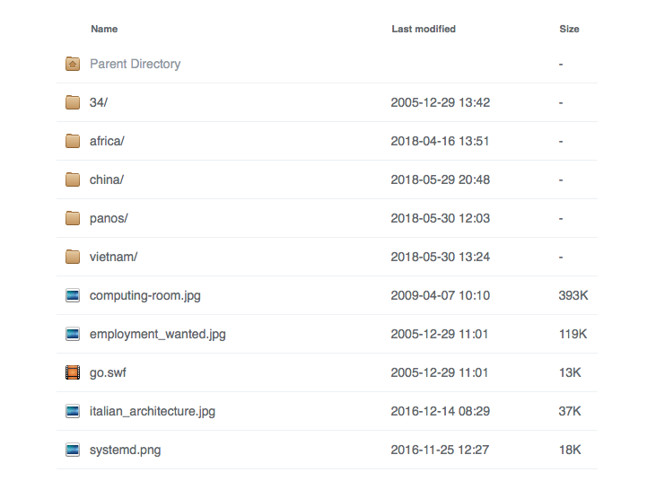

In this post, the techniques of the previous posts are combined for pretty directory listings. Most of the heavy lifting is done in the browser, requiring only [static files](static-resources.md) on the server.

Out-of-the-box Apache directory listings still have that minimalist oh-so-90s look. You can do better than that.

# Ingredients

For elegant listings, get [Apaxy](https://github.com/oupala/apaxy). It uses the beautiful [Faenza icon theme](https://www.gnome-look.org/content/show.php/Faenza?content=128143):

```shell
    cd /usr/local/share ; git clone https://github.com/oupala/apaxy.git
```
    
It looks like this: 

# Configuration

Next, add this to `/etc/apache2/options/apaxy.conf`. It is an edited copy of `/usr/local/share/apaxy/apaxy/htaccess.txt` with bits taken from `/usr/local/share/apaxy/apache-config.conf`:

```apache
    # Apaxy by @adamwhitcroft
    #
    # For a full breakdown of the mod_autoindex module:
    # http://httpd.apache.org/docs/2.4/mod/mod_autoindex.html

    Alias /.apaxy /usr/local/share/apaxy/apaxy/theme

    <Directory /usr/local/share/apaxy/apaxy/theme/>
        Require all granted
        Options none
        Include options/expires.conf
        Include options/nolog.conf
    </Directory>

    <IfModule mod_autoindex.c>

        # INDEX OPTIONS
        IndexOptions +Charset=UTF-8 +FancyIndexing +IgnoreCase +FoldersFirst +XHTML +HTMLTable +SuppressRules +SuppressDescription +NameWidth=* +IconsAreLinks

        # META VIEWPORT
        IndexHeadInsert "<meta name=\"viewport\" content=\"width=device-width, initial-scale=1\" />"

        # HIDE STUFF
        IndexIgnore ".??* *~ *# HEADER* README* RCS CVS *,v *,t"

        # GENERAL ICONS (BLANK, DIRECTORY, PARENT DIRECTORY)
        AddIcon /.apaxy/icons/blank.png ^^BLANKICON^^
        AddIcon /.apaxy/icons/folder.png ^^DIRECTORY^^
        AddIcon /.apaxy/icons/folder-home.png ..
    
        AddIconByType (TXT,/.apaxy/icons/text.png) text/*
        AddIconByType (IMG,/.apaxy/icons/image.png) image/*
        AddIconByType (SND,/.apaxy/icons/audio.png) audio/*
        AddIconByType (VID,/.apaxy/icons/video.png) video/*

        # EXTENSION SPECIFIC ICONS
        AddIcon /.apaxy/icons/archive.png .7z .bz2 .cab .gz .tar
        AddIcon /.apaxy/icons/audio.png .aac .aif .aifc .aiff .ape .au .flac .iff .m4a .mid .mp3 .mpa .ra .wav .wma .f4a .f4b .oga .ogg .xm .it .s3m .mod
        AddIcon /.apaxy/icons/bin.png .bin .hex
        AddIcon /.apaxy/icons/bmp.png .bmp
        AddIcon /.apaxy/icons/c.png .c
        AddIcon /.apaxy/icons/calc.png .xlsx .xlsm .xltx .xltm .xlam .xlr .xls .csv
        AddIcon /.apaxy/icons/cd.png .iso
        AddIcon /.apaxy/icons/cpp.png .cpp
        AddIcon /.apaxy/icons/css.png .css .sass .scss
        AddIcon /.apaxy/icons/deb.png .deb
        AddIcon /.apaxy/icons/doc.png .doc .docx .docm .dot .dotx .dotm .log .msg .odt .pages .rtf .tex .wpd .wps
        AddIcon /.apaxy/icons/draw.png .svg .svgz
        AddIcon /.apaxy/icons/eps.png .ai .eps
        AddIcon /.apaxy/icons/exe.png .exe
        AddIcon /.apaxy/icons/gif.png .gif
        AddIcon /.apaxy/icons/h.png .h
        AddIcon /.apaxy/icons/html.png .html .xhtml .shtml .htm .URL .url
        AddIcon /.apaxy/icons/ico.png .ico
        AddIcon /.apaxy/icons/java.png .jar
        AddIcon /.apaxy/icons/jpg.png .jpg .jpeg .jpe
        AddIcon /.apaxy/icons/js.png .js .json
        AddIcon /.apaxy/icons/markdown.png .html
        AddIcon /.apaxy/icons/package.png .pkg .dmg
        AddIcon /.apaxy/icons/pdf.png .pdf
        AddIcon /.apaxy/icons/php.png .php .phtml
        AddIcon /.apaxy/icons/playlist.png .m3u .m3u8 .pls .pls8
        AddIcon /.apaxy/icons/png.png .png
        AddIcon /.apaxy/icons/ps.png .ps
        AddIcon /.apaxy/icons/psd.png .psd
        AddIcon /.apaxy/icons/py.png .py
        AddIcon /.apaxy/icons/rar.png .rar
        AddIcon /.apaxy/icons/rb.png .rb
        AddIcon /.apaxy/icons/rpm.png .rpm
        AddIcon /.apaxy/icons/rss.png .rss
        AddIcon /.apaxy/icons/script.png .bat .cmd .sh
        AddIcon /.apaxy/icons/sql.png .sql
        AddIcon /.apaxy/icons/tiff.png .tiff .tif
        AddIcon /.apaxy/icons/text.png .txt .nfo
        AddIcon /.apaxy/icons/video.png .asf .asx .avi .flv .mkv .mov .mp4 .mpg .rm .srt .swf .vob .wmv .m4v .f4v .f4p .ogv
        AddIcon /.apaxy/icons/xml.png .xml
        AddIcon /.apaxy/icons/zip.png .zip
        DefaultIcon /.apaxy/icons/default.png

        # THEME FILES
        HeaderName /.apaxy/header.html
        # ReadmeName /.apaxy/footer.html
        IndexStyleSheet /.apaxy/style.css

    </IfModule>
```
    
You could precompress files in `/usr/local/share/apaxy/apaxy/theme`, but this will make a mess in case of updates, and the bit of extra latency does not hurt much. Note that the `header.html` and `footer.html` files **must not** be precompressed, because they are included in the generated pages.

Note that `ReadmeName /.apaxy/footer.html` is commented out. To use it, you would need to replace `/{FOLDERNAME}/theme` by `/.apaxy`. This will happen in a minute.

Activate it to any virtual host or directory like so:

```apache
    Include options/apaxy.conf
```

Happy? Well, so far it's only style. There is still room for usability.

Want to view basic-configuration.md in a pop-up instead of using the back button? Scroll through them? Have them displayed in a slide show? Then read on.

# Image boxes

To prepare, install [JQuery](http://jquery.com/download/) to `/usr/local/share/javascript/jquery`, and [Colorbox](https://github.com/jackmoore/colorbox/) to `/usr/local/share/javascript/colorbox`:

```shell
    cd /usr/local/share
    mkdir -p javascript/jquery ; cd javascript
    git clone https://github.com/jackmoore/colorbox.git
    cd jquery
    wget https://code.jquery.com/jquery-3.3.1.min.js
```

For shared Javascript resources, add the following to `options/javascript.conf`:

```apache
    Alias /.js /usr/local/share/javascript
    <Directory /usr/local/share/javascript>
        Options None
        Require all granted
        Include options/expires.conf
        Include options/nolog.conf
        Include options/precompressed.conf
    </Directory>
```

Feel free to precompress the JS and CSS files in `/usr/local/share/javascript`, but keep in mind to uncompress everything before making updates.

Now comes the fun part. First, add some configuration to `options/apaxy-gallery.conf`:

```apache
    Include options/apaxy.conf
    Include options/javascript.conf

    Alias /.gallery /usr/local/share/apaxy-gallery
    <Directory /usr/local/share/apaxy-gallery>
        Options None
        Require all granted
        Include options/expires.conf
        Include options/nolog.conf
        Include options/precompressed.conf
    </Directory>

    HeaderName /.gallery/header.html
    ReadmeName /.gallery/footer.html
```

Note the nested `Include` statements, and that the generic `header.html` from the previous section is replaced, and a new `footer.html` is added. 

Add `/usr/local/share/apaxy-gallery/header.html`:

```html
    <link rel="stylesheet" href="/.js/colorbox/example1/colorbox.css" />
    <script src="/.js/jquery/jquery-3.3.1.min.js"></script>
    <script src="/.js/colorbox/jquery.colorbox-min.js"></script>
    <script type="text/javascript" src="/.gallery/gallery.js"></script>

    <div class="wrapper">
```

and `/usr/local/share/apaxy-gallery/footer.html`:

```html
    </div><!-- /.wrapper -->

    <div class="footer">
    	Apaxy by <a href="https://twitter.com/adamwhitcroft">@adamwhitcroft</a>
    </div><!-- /.footer -->
    <script src="/.apaxy/apaxy.js"></script>
```

Finally, add `/usr/local/share/apaxy-gallery/gallery.js` and precompress it if you like:

```javascript
    $(document).ready( function() {
    	$('td.indexcolname a[href$=".jpg"], \
    	   td.indexcolname a[href$=".png"], \
    	   td.indexcolname a[href$=".svg"]')
    		.each( function() {
    			$(this).attr( 'title', $(this).text());
    		})
    		.colorbox({
    			rel: 'gallery',
    			maxWidth:  '100%',
    			maxHeight: '100%',
    		});
    });
```

For a slide show of all basic-configuration.md in a directory, add to the colorbox options somthing like this and put the result in `/usr/local/share/apaxy-gallery/slideshow.js`:

```javascript
	open: true,
	slideshow: true,
	slideshowSpeed: 3000,
```

The colorbox will open automatically, and the next image will show every 3 seconds. Check the [Colorbox documentation](http://www.jacklmoore.com/colorbox/) for more options.

To enable the gallery and fancy listings, add to virtual hosts:

```apache
    Include options/apaxy-gallery.conf
```

You can override the behaviour per directory, e.g. with:

```apache
    HeaderName /.gallery/slideshow.html
```

Have fun! The [next post](svn.md) explains how a similar style can be added to [Subversion](https://subversion.apache.org) listings.
